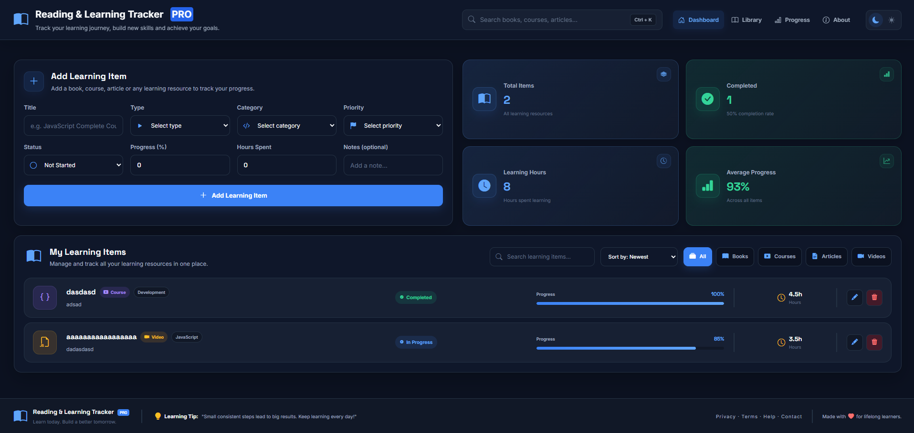

<div align="center">

# 📚 Reading & Learning Tracker PRO

A modern and responsive learning tracker built with **HTML, CSS and Vanilla JavaScript**.

Track books, courses, articles and videos, monitor your progress, manage learning hours and organize your learning journey.

### 🔗 Live Demo

[View Live Demo](https://johnyisbackk.github.io/js-reading-learning-tracker-pro/)

<br>


</div>

---

## 📸 Preview



---

## ✨ Features

- Add new learning resources
- Edit existing learning items
- Delete learning items
- Track progress from 0–100%
- Track learning hours
- Set learning priority
- Set learning status
- Search learning items
- Filter by resource type
- Sort learning items
- Dynamic learning statistics
- Dynamic Bootstrap Icons
- Light / Dark mode
- Theme persistence with LocalStorage
- Learning data persistence with LocalStorage
- Smooth navigation
- Responsive design

---

## 📚 Learning Resource Types

The application supports multiple learning resource types:

- Books
- Courses
- Articles
- Videos

Each learning item can contain:

- Title
- Type
- Category
- Priority
- Status
- Progress
- Hours spent
- Notes

---

## 📊 Statistics

The dashboard automatically calculates:

- Total learning items
- Completed items
- Completion rate
- Total learning hours
- Average progress

---

## 🔍 Search, Filter & Sort

Learning resources can be searched by:

- Title
- Type
- Category
- Notes

Resources can also be filtered by:

- All
- Books
- Courses
- Articles
- Videos

Sorting options include:

- Newest
- Oldest
- Progress: High to Low
- Progress: Low to High
- Title: A–Z

---

## 🌙 Light / Dark Mode

The application supports both dark and light themes.

The selected theme is saved using `localStorage`, so the preference remains after refreshing the page.

---

## 💾 Local Storage

Learning items are stored in the browser using the LocalStorage API.

This means added, edited and deleted learning resources remain saved after refreshing or reopening the application.

---

## 🧠 How It Works

Each learning resource is stored as a JavaScript object:

```js
{
  id: 1720000000000,
  title: "JavaScript Complete Course",
  type: "course",
  category: "javascript",
  priority: "high",
  status: "in-progress",
  progress: 65,
  hours: 24,
  notes: "Finish advanced JavaScript section"
}
```

The main application flow follows:

```text
User Action
    ↓
Update State
    ↓
Save Data
    ↓
Render UI
    ↓
Update Statistics
```

Search, filtering and sorting use a separate pipeline:

```text
Items
  ↓
Search
  ↓
Filter
  ↓
Sort
  ↓
Render
```

---

## 🛠️ Technologies

- HTML5
- CSS3
- Vanilla JavaScript
- Bootstrap Icons
- Google Fonts
- LocalStorage API
- DOM API

---

## 📁 Project Structure

```text
reading-learning-tracker-pro/
│
├── index.html
├── style.css
├── script.js
├── preview.png
├── README.md
└── LICENSE
```

---

## 🚀 Run Locally

Clone the repository:

```bash
git clone https://github.com/JohnYisBackk/reading-learning-tracker-pro.git
```

Open the project folder:

```bash
cd reading-learning-tracker-pro
```

Then open:

```text
index.html
```

in your browser.

No dependencies or build tools are required.

---

## 💡 What I Learned

This project helped me practice and improve:

- Application state management
- CRUD operations
- Function parameters
- Updating existing objects
- Dynamic DOM rendering
- Creating nested DOM elements
- `find()`
- `filter()`
- `sort()`
- `reduce()`
- Search logic
- Filtering pipelines
- Sorting pipelines
- Form validation
- Editing existing data
- LocalStorage persistence
- Dynamic Bootstrap Icons
- Statistics calculations
- Theme persistence
- Responsive UI design
- Separating state from DOM rendering

A key concept reinforced in this project was:

```text
STATE → SAVE → RENDER
```

Another important concept was learning how to update an existing object instead of always creating a new one.

---

## 👨‍💻 Author

**Samuel Jahn**

Frontend Developer

🌐 Portfolio:  
https://samueljahn.sk

💻 GitHub:  
https://github.com/JohnYisBackk

---

## 📄 License

This project is licensed under the **MIT License**.

Copyright (c) 2026 Samuel Jahn

---

<div align="center">

Made with ❤️ while learning JavaScript.

</div>
